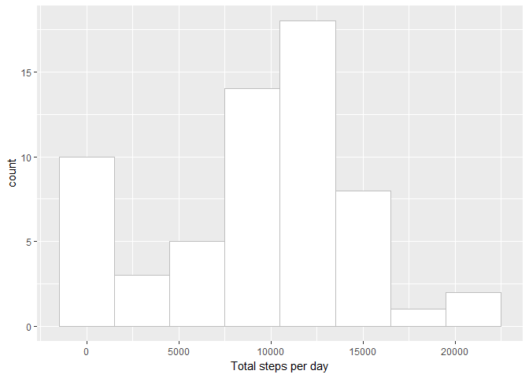
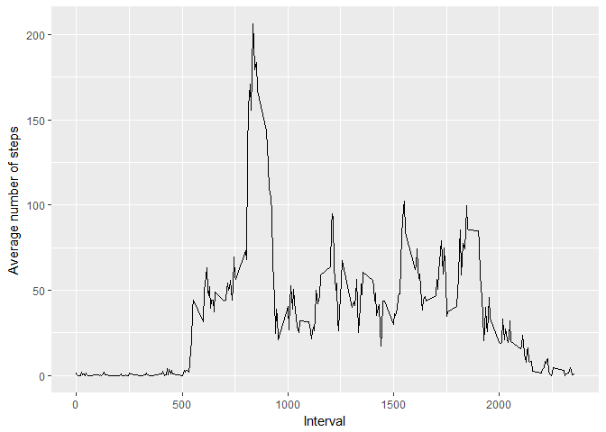
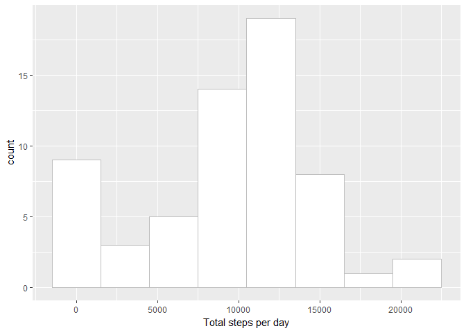
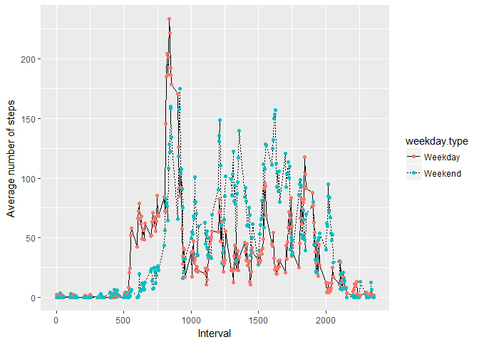

## Loading and preprocessing the data


```r
library(dplyr)
```

```
## Warning: package 'dplyr' was built under R version 3.4.3
```

```
## 
## Attaching package: 'dplyr'
```

```
## The following objects are masked from 'package:stats':
## 
##     filter, lag
```

```
## The following objects are masked from 'package:base':
## 
##     intersect, setdiff, setequal, union
```

```r
library(ggplot2)
```

```
## Warning: package 'ggplot2' was built under R version 3.4.3
```

```r
library(reshape2)
```

```
## Warning: package 'reshape2' was built under R version 3.4.4
```

```r
activity<-read.csv("activity.csv", header=TRUE, sep=",")
```

## What is mean total number of steps taken per day?

### 1 & 2 Histogram of the total number of steps taken per day


```r
library(dplyr)
library(ggplot2)
activity<-read.csv("activity.csv", header=TRUE, sep=",")
by_date<-group_by(activity, date)
summ_steps<-summarize(by_date,
  sum=sum(steps, na.rm=TRUE)
  )
```

```r
ggplot(summ_steps, aes(x = sum)) +
  geom_histogram(binwidth=3000, 
                 color="grey", 
                 fill="white") +
  labs(x="Total steps per day")
```

<!-- -->

### 3 Mean and Median number of steps taken per day

The mean is

```r
mean(summ_steps$sum, na.rm = TRUE)
```

```
## [1] 9354.23
```

The median is

```r
median(summ_steps$sum, na.rm = TRUE)
```

```
## [1] 10395
```
## What is the average daily activity pattern?


```r
by_interval<-group_by(activity, interval)
av_steps<-summarize(by_interval,
  mean=mean(steps, na.rm=TRUE)
  )
```

```r
ggplot(av_steps, aes(x = interval, y=mean)) +
  geom_line() +
  labs(x="Interval", y="Average number of steps")
```

<!-- -->

## Inputing missing values

### Missing values

```r
missing <- is.na(activity$steps)
table(missing)
```

```
## missing
## FALSE  TRUE 
## 15264  2304
```
### Plugging the gaps

```r
# We have the average number of steps per interval in av_steps, above
# Replace each NA with the mean from that interval
# Firstly, creating a new version of activity - plugged_activity

plugged_activity <- activity
for (i in 1:nrow(plugged_activity)) {
plugged_activity[i,1] <-  ifelse(is.na(plugged_activity[i, 1]) ==
                                  TRUE,
                                  av_steps[i, 2],
                                  plugged_activity[i, 1])
}
```
### Histogram and mean and median of the plugged data for activities

```r
by_date<-group_by(plugged_activity, date)
p_summ_steps<-summarize(by_date,
  sum=sum(steps, na.rm=TRUE)
  )
```

```r
ggplot(p_summ_steps, aes(x = sum)) +
  geom_histogram(binwidth=3000, 
                 color="grey", 
                 fill="white") +
  labs(x="Total steps per day")
```

<!-- -->

The mean is

```r
mean(p_summ_steps$sum, na.rm = TRUE)
```

```
## [1] 9530.724
```

The median is

```r
median(p_summ_steps$sum, na.rm = TRUE)
```

```
## [1] 10439
```
## Are there differences in activity patterns between weekdays and weekends?


```r
# Convert 'date' in plugged_activity to date (from factor)
plugged_activity$date <- as.Date(plugged_activity$date)

# add new variable
plugged_activity$weekday = weekdays(plugged_activity$date)
plugged_activity$weekday.type <- ifelse(plugged_activity$weekday == "Saturday" | plugged_activity$weekday == 
    "Sunday", "Weekend", "Weekday")
plugged_activity$weekday.type <- factor(plugged_activity$weekday.type)

# plot time series

by_interval_day<-group_by(plugged_activity, interval, weekday.type)
av_steps<-summarize(by_interval_day,
  mean=mean(steps, na.rm=TRUE)
  )

ggplot(av_steps, aes(x=interval, y=mean, group=weekday.type)) +
  geom_line(aes(linetype=weekday.type))+
  geom_point(aes(color=weekday.type)) +
  ylab(label="Average number of steps") + 
  xlab("Interval")
```

<!-- -->
